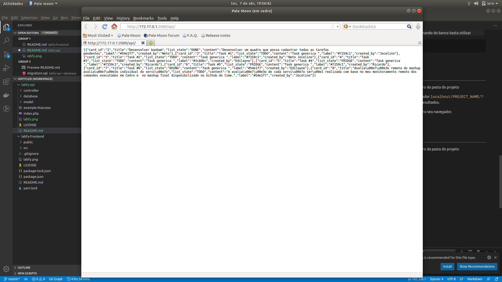

# Labfy - Tickets
-----------------


> Este repositório é a aplicação backend `Labfy`, desenvolvida para funcionar como uma api para o repositório [Labfy](https://github.com/netojocelino/labfy-frontend), que foi desenvolvido
> seguindo o tutorial do vídeo [Recriando Pipefy do zero (com drag n' drop)](https://www.youtube.com/watch?v=awRtgpRsdTQ).


## Visão geral
--------------

Aplicação para listar cards que aguardam ser atendidas, seguindo o fluxo de **Para fazer**, **Fazendo**, **Feito** ou **Congelado**.


## Pré-requisitos
-----------------
- PHP
- MySql ou MariaDB
- Apache2 (ou PHP `>= PHP 5.4` utilizando [*Built-in server*](https://www.php.net/manual/pt_BR/features.commandline.webserver.php)) 


## Instalação
-------------

Primeiramente precisamos ter este projeto no computador, logo, podemos baixar o projeto seguindo os passos:

 - Clone esse repositório com

 ```$ git clone https://github.com/netojocelino/labfy-backend.git```


Abaixo temos um tutorial bem básico sobre a instalação de Apache, PHP e MariaDB. Para informações mais detalhadas pode ser acessado [neste tutorial](https://sempreupdate.com.br/como-instalar-apache-mariadb-php7-lamp-stack-ubuntu-16-04-lts/).

 ### Apache

**Apache** é o servidor web mais popular no mundo, para instalar no Ubuntu ou derivados podemos utilizar o gerenciador de pacotes apt. 
 ```sh
    $ sudo apt update -y
    $ sudo apt upgrade -y
    $ sudo apt install apache2
    $ sudo systemctl status apache2
 ```


 ### PHP

 **PHP** será a linguagem para gerenciar o conteúdo, conectando-se ao MariaBD e processar as informações do servidor web pela API.

 Para instalar basta executar os seguintes comandos:

 ```sh
    $ sudo apt install php libapache2-mod-php php-mysql
 ```

 ### MariaDB

 **MariaDB** é um sistema gerenciador de banco de dados, que organiza e dispõe acesso aos bancos para que possa ser realizado a persistência de informações. 
 
 Para instalar basta executar

 ```sh
    $ sudo apt install mariadb-server mariadb-client
 ```


Uma vez que você tem tudo instalado pode seguir os passos abaixo para criar um usuário no banco de dados assim como suas tabelas:

Para acessar o painel de acessoa de MariaDB pela linha de comando é utilizado:
 > É importante que estejamos na pasta `/database` para subir o arquivo completo.

```sh
   $ mysql -uroot -h127.0.0.1
```
 > O parametro `-p` deve ser usado caso na instalação de MariaDB foi configurado uma senha.


Para configurar tudo usamos o arquivo `/database/migration.sql`.

- ***Configurar usuário***: este arquivo possui linhas (1 até 3) para criar um usuário `labfy` que está configurado como o usuário administrativo para este projeto. Estas linha devem ser coladas na linha de comando.

 - ***Criar tabelas:*** Após isso, pode ser executado as linhas 5 até 33 para criar o banco `labfy` com as tabelas e o registro do quadro principal.
 
 - ***Popular banco:*** Para adicionar informações para popular o teste podem ser executados as linhas 35 até 41.

> Caso deseje realizar todos os comandos, após executar o comando do banco basta utilizar 
```sh
   MariaDB [(none)]> source migration.sql
```

Pronto! Já podemos rodar a api. :satisfied:


## Executar teste
-----------------

Após já ter instalado os pré-requisitos, basta seguir abaixo dentro da pasta do projeto
- Tendo instalado na pasta do Apache basta abrir no navegador `localhost/PROJECT_NAME/?key=index/index` e ele irá retornar a lista de todos os resultados.

Para ver o projeto rodando, você pode abrir `localhost:3000` no seu navegador.




## Rotas para Exeutar projeto
Para ter informações basta executar a rota `/api/?key=index/index` utilizando o método HTTP `OPTIONS`.


## Licença

MIT &copy; [Neto Jocelino](https://github.com/netojocelino/)
